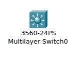

# multi_layer_sw_HSRP konfigurálás

<i>Multi layer switch avagy gúnynevén az ánusz/napocska switch</i>

```bash


en
conf t
hostname R1

ip domain-name wmtech.hu
crypto key generate rsa 
1024

ip ssh version 2

username admin privilege 15 secret 1234

enable secret 1234
no ip domain-lookup 

line console 0
password 1234

line console 0
login local
password 1234

```
### hiba üzenetek kikapcsolása a multilayer sw szeret yappingelni/szószátyár üzemmódba kpcsolni érdemes kikapcsolni
```bash

logging syncron

```

```bash
exit

login local
exit

service password-encryption 

banner motd #Unauthorised access is prohibited!#

line vty 0 15
password 1234
transport input ssh 
login local 
exit

banner login #dobozolni a legjobb a vilagon ornagy#


vlan 10
name VARO-PUB
ex

int vlan 10
ip add 192.168.0.26 255.255.255.224
no sh
ex


vlan 20
name DISZP
ex

int vlan 20
ip add 192.168.0.58 255.255.255.224
no sh
ex


vlan 30
name STAFF
ex

int vlan 30
ip add 192.168.0.89 255.255.255.224
no sh
ex


vlan 99
name MGMT
ex

int vlan 99
ip add 192.168.0.121 255.255.255.224
no sh
ex

```

## multilayer switchben lehetöségünk van egy switchportot router interfésszé átformálni csak annyit kell beirnunk hogy __no switchport__
### A routing funkció engedélyezése hogy mondjuk a L3 sw tudjon ospfvt is kezelni: __ip routing__

```bash

int g0/1 
no switchport                       ! multilayer sw3 ban sw portot sima interfészé
ip routing                          ! multilayer sw3 ip r   outing engedélyezése

```


```bash


int range fa0/1-8
sw mode access
sw acces vlan 10
ex

int range fa0/9-16
sw mode access
sw acces vlan 20
ex

int range fa0/17-24
sw mode access
sw acces vlan 30
ex

```

## mikor az L3 switcheknek nehéz napja van akkor baby ragelnek ilyenkor fülükbe kell sugni hogy : __switchport trunk e dot1q__

### __switchport trunk e dot1q__ --> lényegében a trunk port engedélyezése (enélkül nem lehet és ez NEM subinterface miatt csniáljuk!!!)

```bash

int range gig0/1-2
switchport trunk e dot1q            ! multilayer sw3 ban kell
sw mode trunk 
sw trunk allowed vlan 10,20,30,99
switchport trunk native vlan 99
ex

```


```bash

int vlan 10
standby version 2
standby 10 ip 192.168.0.1
standby 10 priority 100
standby 10 preempt 
ex


int vlan 20
standby version 2
standby 20 ip 192.168.0.33
standby 20 priority 100
standby 20 preempt 
ex

int vlan 30
standby version 2
standby 30 ip 192.168.0.65
standby 30 priority 100
standby 30 preempt 
ex


end 

copy running-config startup-config


router ospf 10
router-id 3.3.3.3
network 192.168.0.0 0.0.0.31 area 0
network 192.168.0.32 0.0.0.31 area 0
network 192.168.0.64 0.0.0.31 area 0
network 192.168.0.96 0.0.0.31 area 0
network 192.168.0.128 0.0.0.31 area 0
ex


```
